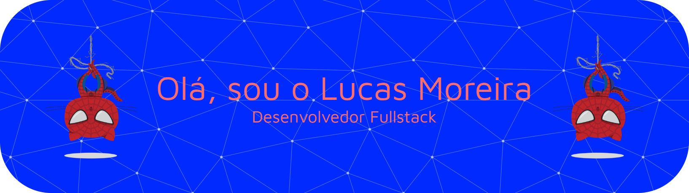

<h1 align="center">👨‍💻 Lucas M Medeiros</h1>

Desenvolvedor focado em interfaces modernas e soluções eficientes 🚀

---

## 🙋‍♂️ Sobre mim

Olá! Eu sou o Lucas M Medeiros 👋  

Tenho 19 anos, estou no 3º sementre de Analise Desenvolvimento de Sistemas. Sou um desenvolvedor focado em criar soluções eficientes e interfaces modernas. Atualmente, estou expandindo meus conhecimentos em desenvolvimento web.

---

<!-- Streak-->

  
## 📊 Estatísticas
 

---

  
## 🧠 Linguagens e Tecnologias

---
 

###

